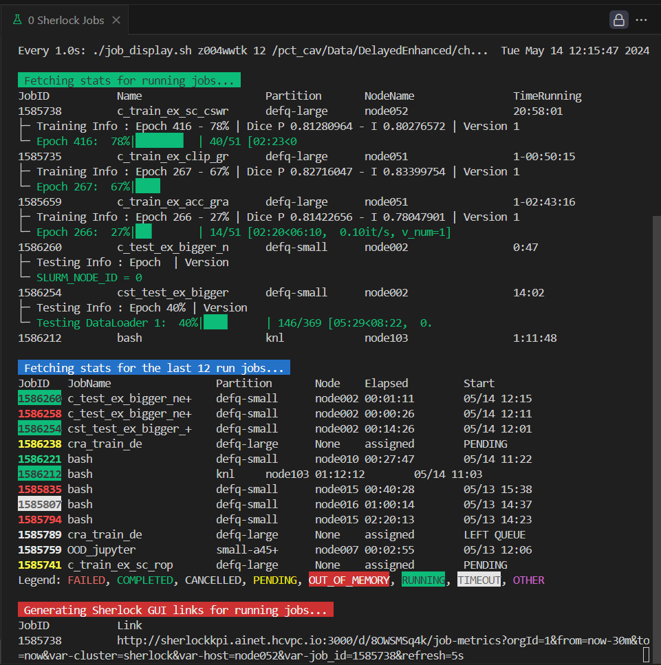

# slurm-utilities

## Job View

Dynamic Slurm bash displayer tailored to Siemens' Sherlock.
- Statistics for Running Jobs
  - JobID - Name - Partition - NodeName - Time Running
  - (Optional) Features a lightning training logs scraping
    - Current Epoch - Current Epoch Progress - Dice Scores - Version
  - (Optional) Features a lightning testing logs scraping
    - Current Epoch Progress - Version
  - Displays the lastest line of each job's slurm output file
- Statistics for the last N jobs
  - JobID (color=STATE) - JobName - Partition - Node - Elapsed - Start
- Sherlock GUI links
  - JobID - Link

### Usage

`./job_view.sh <user> <job_history_length> <job_slurm_logs_root_file> [-w watch_frequency] [-L]`

├─ user: The username of the user whose jobs you want to monitor

├─ job_history_length: The number of jobs in the history to display

├─ job_slurm_logs_root_file: The root directory where the slurm logs are stored

├─ -w: watch_frequency: job display update delay

└─ -L: if set, displays the training progress of the lightning training jobs (\*train\* in JobName)

### Example

`./job_view.sh q4t6000 10 /path/to/slurm/logs/root/file -w 5 -L`

### Tips

- Lightning training logs scraping is pretty slow, so it is recommended to set the watch frequency to 5 seconds or more.

## Cancel Oldest Job

Cancels the oldest job of a user.

### Usage

`./cancel_oldest_job.sh <user>`

## Job Sabotage

Kills a specific from any user and all its dependencies using only its ID.
Note : the script is not yet fully functional and depends on the user's permissions and policies.

### Usage

`./job_sabotage.sh <job_id> <account>`

├─ job_id: The ID of the job to kill

└─ account: Your slurm account

### Example

`./job_sabotage.sh 123456`
